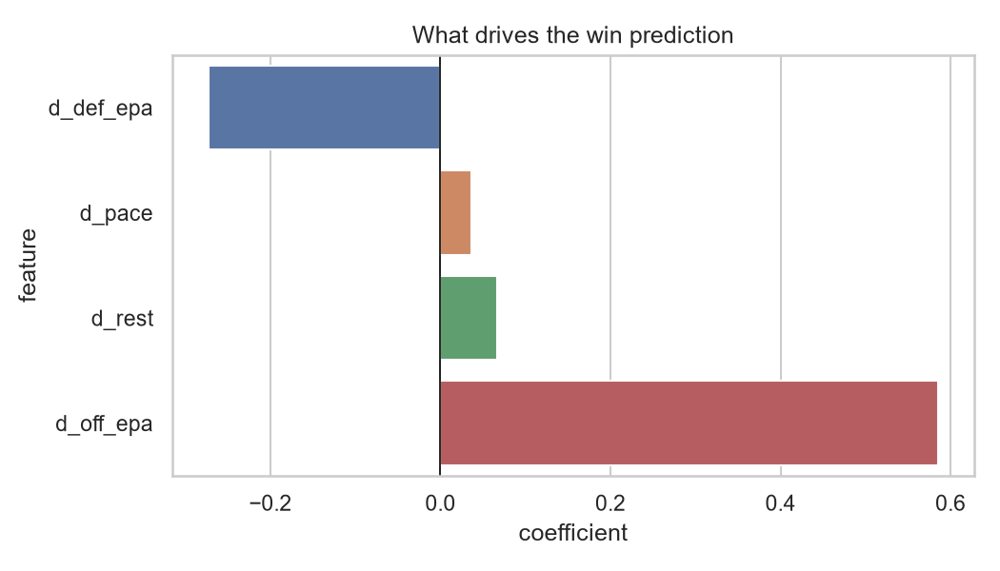

# NFL Game Prediction Model

Predicts NFL game outcomes from team efficiency, pace, and rest using
logistic regression on eight seasons of play-by-play data.

## Results

Trained on 2018-2023, tested on 2024-2025 544 games.

| Target | Accuracy | AUC | Log loss |
|---|---|---|---|
| Home team wins | 0.616 | 0.677 | 0.64 |
| Home team covers the spread | 0.5 | 0.51 | 0.696 |

## Approach

**Data.** Play-by-play and schedule data from nflverse via `nflreadpy`,
2018 through 2025 regular season.

**Features.** Four differences between the home and away team, each built
from an 8-game rolling average of that team's *previous* games:

- Offensive EPA per play
- Defensive EPA allowed per play
- Pace, measured as offensive plays per game
- Rest days before the game

Every rolling average is shifted by one game so no game contributes to
its own prediction. Skipping this step inflates accuracy substantially
and produces a model that cannot predict anything it has not already seen.

**Model.** Logistic regression with standardized features, fit through a
scikit-learn pipeline so scaling is learned on training data only.

**Validation.** Split by season rather than randomly. A random split lets
future games inform predictions about past ones, which real forecasting
never gets to do.

## What I found

Offensive EPA differential does most of the work. Pace and rest contribute
almost nothing once efficiency is accounted for.

The model predicts winners reasonably well and does not beat the closing
spread. That is the expected result: the betting line already incorporates
public efficiency stats along with injuries, weather, and market movement.
Breaking even against standard -110 pricing requires 52.4% accuracy, and
four public features fit with a linear model do not get there.

The more useful framing is how much of the market's information four public
stats can recover on their own.

## Running it

    git clone https://github.com/natcol06/nfl-spread-model.git
    cd nfl-spread-model
    python -m venv .venv
    source .venv/Scripts/activate     # macOS/Linux: source .venv/bin/activate
    pip install -r requirements.txt
    cd src
    python model.py

First run downloads roughly [X] MB from nflverse and caches it to `data/`.

## Layout

    src/data.py       load and cache raw nflverse data
    src/features.py   rolling team form and difference features
    src/model.py      train, evaluate, chart
    explore.ipynb     exploratory analysis
    figures/          generated charts

## Next steps

- Add an Elo rating to capture schedule strength, which raw EPA misses
- Split offensive EPA into passing and rushing, since passing is more predictive
- Compare predicted probabilities against moneyline-implied probabilities
- Test whether gradient boosting beats logistic regression on a dataset this size